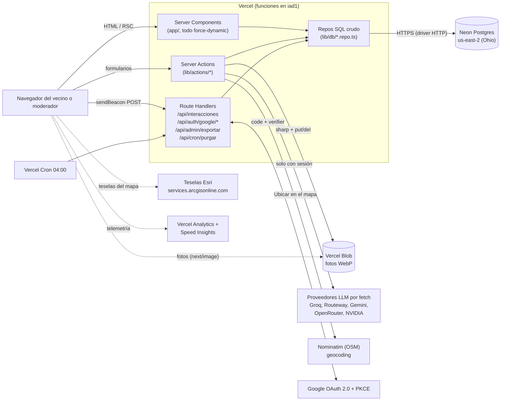
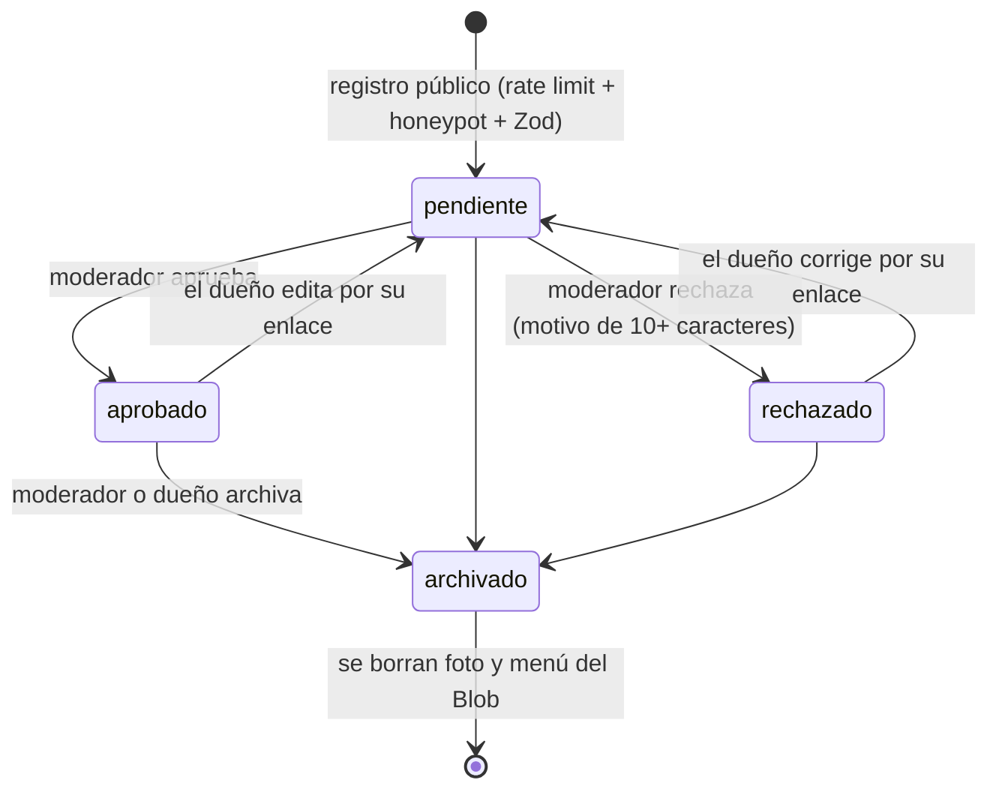

# Arquitectura y costos

Documento para el equipo y para el cliente. Explica cómo está armada la app, dónde se va a apretar cuando crezca y cuánto costaría operarla. Se escribió el **2026-09-29** leyendo el código del repo y las páginas oficiales de precios (fecha de consulta y URL en la sección 5.7).

**Cómo leer las etiquetas.** Cada dato dudoso lleva una:

| Etiqueta | Significa |
|---|---|
| **[V]** | Verificado: sale del código del repo o de una página oficial citada. |
| **[E]** | Estimado: cuenta hecha con supuestos escritos en el mismo lugar. Hay que medirlo antes de decidir con él. |
| **[SV]** | Sin verificar: no se pudo confirmar en fuente oficial. No lo uses para decidir. |

## Resumen para quien solo lee esto

- La app es un directorio público de negocios y oficios de la Comuna 3 (Manrique) con registro abierto, moderación humana y consentimiento de datos (Ley 1581). Hoy corre en planes gratuitos: **$0/mes**.
- **Vercel Hobby prohíbe el uso comercial** y define «comercial» de forma amplia (incluye que alguien cobre por crear, actualizar o alojar el sitio). Si el proyecto tiene cliente y presupuesto, el paso a **Pro ($20/mes)** no es una optimización: es cumplir los términos (sección 5.3).
- El primer techo real **no es Vercel sino Neon**: el plan gratis da 100 CU-horas al mes y la base se queda despierta 5 minutos después de cada visita. Con tráfico repartido durante el día, ese cupo se agota hacia las ~10.000 páginas vistas al mes, o antes si un bot la mantiene despierta.
- El código tenía tres cuellos de botella propios (listado de Aliados sin paginación, todo el sitio dinámico sin caché de lecturas y `/api/interacciones` sin límite). **Se corrigieron el 2026-09-29**; qué se hizo y qué queda pendiente está al inicio de la sección 4.1.
- Costo mensual estimado: **hoy $0**; a 10× (~10.000 páginas vistas) **~$30–40**; a 100× (~100.000) **~$40–75** (tabla en 5.5, con todos los supuestos).

---

## 1. Qué es la app y qué módulos tiene

**Constelaciones — Manrique** (`territorio-inn-2026-manrique`): vitrina pública donde un vecino registra su negocio u oficio en unos minutos y queda en un mapa. Nada se publica sin que un moderador lo apruebe. Se presentó a la convocatoria Presupuesto Participativo Comuna 3 + ITM, reto #2 (Empleo y Desarrollo Económico). Producción: https://territorio-inn-2026-manrique.vercel.app [V: `README.md`].

| Módulo | Rutas | Estado | Qué hace | Datos (tablas) |
|---|---|---|---|---|
| **Aliados** | `/aliados`, `/aliados/registro`, `/aliados/estado/[token]` | En vivo | Directorio de negocios sobre mapa Leaflet. Registro sin cuenta, con foto y menú opcionales. Quien registra recibe un enlace privado (`token_publico`) para ver, corregir o archivar su ficha. | `portafolios`, `categorias`, `aliados_investigacion` (privado), `aliados_consentimiento`, `definiciones_campo`, `interacciones_portafolio` |
| **Empleo** | `/empleo`, `/empleo/registro`, `/legal/empleo` | En vivo (flag `NEXT_PUBLIC_MODULO_EMPLEO`, encendido en producción según `TASKS.md` 2026-08-31) | Vecinos que buscan trabajo, con contacto directo. Sin foto ni mapa. | `candidatos` |
| **Formalización + asesor** | `/formalizacion`, botón flotante `AsesorFlotante` | En vivo, solo con sesión | Catálogo de 11 pasos (trámites y apoyos) (`lib/formalizacion.ts`) personalizado por lo que el vecino contestó. El asesor es un modelo de lenguaje que elige cuál del catálogo le sirve. | lee `aliados_investigacion` |
| **Marca** | `/marca`, `/marca/[guia]` | En vivo; sin sesión solo vista previa | Guías del equipo (fotos con el celular, Instagram, WhatsApp, pitch) como láminas JPG en `public/marca/`. | ninguna (contenido del repo) |
| **Mi cuenta / Entrar** | `/entrar`, `/mi-cuenta` | En vivo | Ingreso con Google; lista los negocios del vecino y su estado. | `usuarios` |
| **Contacto** | `/contacto` | En vivo | Buzón: el mensaje llega a `/admin/peticiones`; el equipo responde por fuera con el contacto que dejó la persona. **El sitio no envía correos** (no hay librería de correo en `package.json`). | `peticiones` |
| **Inventario predictivo** | `/inventario-predictivo` | Apagado (stub, flag `NEXT_PUBLIC_MODULO_INVENTARIO`) | Sin datos detrás. Apagado devuelve 404 y no sale en menú ni sitemap. | ninguna |
| **Panel admin** | `/admin/login`, `/admin/aliados`, `empleo`, `peticiones`, `campos`, `estadisticas`, `asesor`, `formalizacion`, `marca`, `/api/admin/exportar` | En vivo | Moderación (aprobar, rechazar con motivo, archivar), campos personalizados del formulario, estadísticas, exportación CSV. | `admins` y todas las anteriores |

Módulo eliminado: **Servicios** (migración 028 borró `servicios` y `servicios_privado`); quien presta un oficio entra por Aliados [V: `lib/content.ts`, `028_eliminar_servicios.sql`].

Contenido transversal: SEO (`sitemap.ts`, `robots.ts`, `opengraph-image.tsx`), páginas legales (`/legal/terminos`, `/legal/politica-datos`), 30 migraciones SQL en `lib/db/migrations/`.

---

## 2. Arquitectura

### 2.1 Flujo general

Puntos que conviene saber (todos [V], salen del código):

- **El navegador nunca habla con Postgres.** Toda consulta sale de un Server Component, una Server Action o un Route Handler. Por eso no se usa RLS: el control de acceso va en el `where` de cada repo (`AGENTS.md`).
- **Driver HTTP de Neon** (`@neondatabase/serverless`, función `neon()`): cada consulta es un `fetch` HTTPS. Sirve para consultas sueltas; las migraciones usan `Pool` para transacciones (`lib/db/neon.ts`). Lleva `cache: 'no-store'` porque el Data Cache de Next llegó a cachear una consulta vacía.
- **Sin ORM**: SQL parametrizado con template strings, un repo por tabla o dominio.
- **Validación en tres capas**: Zod en cliente, Zod en servidor y `CHECK` en Postgres. Para fotos, el decode de `sharp` es la verificación real del contenido, precedida de una revisión de la firma del archivo.
- **Fotos**: el navegador las comprime a 1200 px WebP (`lib/imagen/comprimir.ts`), el servidor las revalida y las recomprime con `sharp` (1200 px, WebP calidad 80) y las sube a Blob con sufijo aleatorio y caché de un año. Tope de 5 MB por foto; `serverActions.bodySizeLimit` en 6 MB (`next.config.mjs`).
- **Asesor**: un solo `fetch` al formato `/chat/completions` de OpenAI, sin SDK. Recorre `lib/agente/proveedores.ts` en orden (Groq, Routeway, Gemini, OpenRouter, NVIDIA) y usa el primero que responda; solo entran los que tengan clave cargada. Tope de 10 s por proveedor. Nunca se llama desde una ruta pública.
- **Geocoding**: `lib/geo/geocodificar.ts` llama a Nominatim desde el servidor (exige User-Agent que un navegador no puede fijar), con espera mínima de 1 s en memoria de la instancia y su propio cupo de rate limit.

### 2.2 Las dos poblaciones de sesión

| | `admin_session` | `sesion_usuario` |
|---|---|---|
| Quién | Moderadores (equipo) | Vecinos |
| Cómo entra | Contraseña (`scrypt`, `/admin/login`) o Google si su `sub` está en `ADMIN_GOOGLE_SUBS` | Google OAuth 2.0 con PKCE `S256`, `state` aleatorio |
| Duración | 8 h | 14 días |
| Firma | HMAC-SHA256 con `ADMIN_SESSION_SECRET`, `httpOnly`, `sameSite=lax`, `secure` en producción | Igual; en producción con prefijo `__Host-` |
| Identidad | correo del moderador | `google_sub`, **nunca el correo** |
| Alcance | Panel completo | Solo sus propias fichas |

Se mantienen separadas **a propósito**: con una sola cookie y un campo «rol», ese campo sería lo único entre un vecino y el panel. Cada Server Action revalida la sesión por su cuenta, porque una action es un endpoint HTTP invocable sin pasar por ninguna página [V: `docs/seguridad.md`, `lib/auth/admin.ts`, `lib/auth/usuario.ts`].

### 2.3 Flujo de moderación

- Un moderador se identifica en cada decisión (`moderado_por`, `moderado_en`); un `CHECK` de la base impide un estado moderado sin auditoría y un rechazo sin motivo.
- `where estado <> nuevo` evita que dos moderadores se pisen con la pestaña abierta.
- Editar una ficha aprobada como moderador **no** la devuelve a revisión ni toca la trazabilidad.
- El mismo contrato aplica a `candidatos` (Empleo).

### 2.4 Cron de purga y rate limiting

- **Cron**: `vercel.json` declara `0 4 * * *` sobre `/api/cron/purgar`, que borra de `intentos_registro` lo anterior a 1 día. Falla cerrado (503) si falta `CRON_SECRET` y compara con `timingSafeEqual`. En Hobby el cron es como máximo diario y con precisión de ±59 minutos [V: fuente Vercel cron, 5.7].
- **Rate limit en Postgres** (`lib/db/rateLimit.ts`, tabla `intentos_registro`, índice `(ip, origen, creado_en desc)`):

| Origen | Cupo | Ventana |
|---|---|---|
| `registro` (también `/contacto`) | 3 | 10 min |
| `login` (solo fallidos) | 8 | 15 min |
| `estado` (editar por token) | 6 | 10 min |
| `agente` (asesor) | 10 | 5 min |
| `geocodificar` | 8 | 5 min |

  Se cuenta el intento antes de validar. Sin IP no se limita. Detrás de un NAT compartido varias personas comparten cupo. **No tiene cupo en Postgres** el ingreso con Google. `/api/interacciones` (contador de visitas y contactos) tiene desde 2026-09-29 un cupo aparte, de 120 por minuto y por IP, contado en memoria de la instancia (`lib/limiteMemoria.ts`) para no sumar escrituras.

### 2.5 Protección de datos personales (resumen)

Detalle en `docs/seguridad.md` y `docs/analitica.md`; aquí lo esencial.

- **Qué se guarda de personas**: datos del negocio y contacto que la persona publica; `ip_registro` en `portafolios` y `peticiones` (declarada en la política, con consentimiento); `aliados_consentimiento` con versión de la política aceptada, `user_agent` y `ip_hash = sha256(ip + IP_HASH_PEPPER)`. Si falta el pepper, `hashIp()` devuelve `null` y no guarda nada (falla cerrado).
- **Datos de investigación** (`formalidad`, `mayor_dolor`): privados, nunca se publican; alimentan el diagnóstico y el asesor.
- **Analítica sin identificar personas**: `visitas_sitio` (un contador por día) e `interacciones_portafolio` (un contador por negocio, día y tipo) son upserts que suman 1; no existe tabla de eventos individuales, así que no se puede reconstruir el recorrido de nadie y no hace falta banner de cookies. La ubicación del visitante nunca sale del navegador. Vercel Analytics y Speed Insights se declaran sin cookies.
- **Fotos**: el canvas y `sharp` descartan el EXIF (incluido el GPS). Al archivar una ficha se borran la foto y el menú del Blob.
- **Consentimiento**: dos casillas obligatorias (términos y habeas data) con `CHECK` en base; la política versionada (`VERSION_TERMINOS = '2026-09-v3'`) incluye la cláusula de transferencia internacional (Decreto 1377 de 2013, art. 26) porque Neon y Vercel están fuera de Colombia.
- **Cabeceras**: `X-Frame-Options`, `nosniff`, `Referrer-Policy`, `Permissions-Policy`, HSTS y una CSP **en modo solo reporte** (ver riesgos).
- **Brecha a cerrar** (hallazgo de este documento, [V] en código): la política §07 dice que los datos no se comparten «con terceros distintos» de Neon y Vercel, pero el asesor envía a proveedores LLM el nombre, la actividad, el barrio y las respuestas privadas `formalidad` y `mayor_dolor` del negocio del vecino con sesión (`lib/agente/asesor.ts`, `mensajeUsuario`). Los proveedores no están nombrados en la política. Corregir el texto (y subir `VERSION_TERMINOS`) antes de difundir más el asesor. Qué hace cada proveedor con esos datos en su plan gratuito: **[SV]**.

---

## 3. Stack

Versiones tal como están declaradas en `package.json` (rango; la versión instalada exacta la fija `package-lock.json`).

| Tecnología | Versión | Para qué se usa | Por qué se eligió (según el repo) |
|---|---|---|---|
| Next.js (App Router) | 16.3.6 | Sitio, Server Components, Server Actions, Route Handlers | Un solo despliegue en Vercel; las Server Actions reemplazan una API aparte. Ojo: `AGENTS.md` avisa que esta versión difiere de lo que muchos conocen; lee `node_modules/next/dist/docs/`. |
| React / React DOM | ^18.3.1 | UI | El App Router de Next usa el React que Next vendoriza (`useActionState` funciona aunque el paquete sea 18). |
| TypeScript | ^5.6.3 | Tipos (`noUncheckedIndexedAccess` activo) | Los repos y los schemas comparten tipos. |
| Tailwind CSS | ^3.4.13 | Estilos y tokens de diseño | Sistema visual propio en `tailwind.config.ts`. |
| Zod | ^4.4.3 | Validación de todo input externo | Un solo schema para cliente y servidor. |
| `@neondatabase/serverless` | ^1.1.0 | Driver HTTP de Postgres | Consultas sueltas sin pool; el único archivo que conoce el driver es `lib/db/neon.ts`, así que migrar de proveedor es cambiar ese archivo. |
| Neon (Postgres 18, us-east-2) | plan Free | Base de datos | Serverless, rama `dev` gratuita para no migrar contra producción. |
| `@vercel/blob` | ^2.7.0 | Fotos y menús | Integrado a Vercel, autenticación por OIDC (`BLOB_STORE_ID`); portable: la base guarda solo URL y pathname. |
| `sharp` | ^0.35.3 | Redimensionar y convertir a WebP; verificar que sea imagen | Exige runtime Node (ninguna ruta que lo use puede ser Edge). |
| Leaflet / react-leaflet | ^1.9.4 / ^4.2.1 | Mapas | Sin clave ni cuenta; `reactStrictMode` está apagado por un bug conocido de react-leaflet. |
| Teselas Esri «World Light Gray Base» | (servicio externo) | Mapa base gris claro | Sirven sin clave y casan con la paleta. Reemplazaron a CARTO el 2026-08-29, cuando CARTO empezó a estampar «API KEY REQUIRED» (`lib/geo/constantes.ts`). |
| `@turf/boolean-point-in-polygon`, `@turf/helpers` | ^7.4.0 | Geometría del polígono de la comuna | Validar y ubicar puntos. |
| Nominatim (OpenStreetMap) | (servicio externo) | «Ubicar en el mapa» del registro | Gratis y sin clave; no se instala `mapbox` ni `@googlemaps/*` (`AGENTS.md`). |
| Google OAuth 2.0 a mano | — | Ingreso de vecinos y moderadores por Google | Sin NextAuth: la sesión firmada ya existía y una librería dejaría dos sistemas de sesión (`AGENTS.md`). |
| Proveedores LLM por `fetch` | — | Asesor de formalización | Formato OpenAI común; sin SDK para no atarse a un proveedor. Un plan gratis se agota, por eso hay lista con rotación. |
| `@vercel/analytics` / `@vercel/speed-insights` | ^2.0.1 / ^2.0.0 | Visitas y Core Web Vitals | Sin cookies; ver `docs/analitica.md`. |
| `framer-motion` | ^11.11.9 | Animaciones | — |
| Fraunces + DM Sans (`next/font/google`) | — | Tipografía | DM Sans reemplazó a Geist y JetBrains Mono (`app/layout.tsx`). |
| ESLint | ^9.19.0 (`eslint-config-next` 16.3.6) | Lint | — |
| Node | >=20.9.0, ESM | Runtime y scripts `.mjs` | — |
| SonarCloud | — | Análisis estático (proyecto público) | Reporte del 2026-08-31 en `TASKS.md`. |

No hay framework de pruebas ni CI: la verificación es manual (`npm run typecheck && npm run lint && npm run verificar`).

---

## 4. Escalabilidad

### 4.1 Cuellos de botella reales

> **Actualización 2026-09-29 (posterior a la redacción de esta tabla).** Los tres primeros cuellos de botella se atendieron en el código. Las filas de abajo describen el problema original; este es el estado actual:
>
> | # | Estado | Qué se hizo | Qué queda |
> |---|---|---|---|
> | 1 | **Mitigado** | El listado de `/aliados` se pinta en tandas de 24 con «Ver más» (`VitrinaAliados.tsx`); el mapa y la búsqueda siguen usando todas las fichas. | El payload sigue llevando todas las fichas y un marcador por negocio. Pasada la centena o unos cientos, la paginación pasa al servidor y hay que agrupar marcadores. La home sigue pidiendo la lista completa. |
> | 2 | **Mitigado, no resuelto** | Las lecturas públicas (`listarAprobados`, `listarCategorias`, `contarAprobadosPorCategoria`, `listarTodosLosCampos`) salen de `unstable_cache` con etiqueta (`lib/db/cache.ts`) y se invalidan con `invalidarVitrina()` al moderar, editar o borrar; el conteo de visitas de la home se cachea 5 min. Una visita ya no debería consultar la base, salvo por la escritura del contador. | Las páginas siguen siendo dinámicas: el layout `(site)` lee `cookies()`. Cada visita sigue costando una invocación y una escritura en `visitas_sitio`. **No se probó aún** que un negocio aprobado aparezca al instante (requiere sesión de moderador). |
> | 3 | **Mitigado** | Cupo de 120 peticiones por minuto y por IP en `/api/interacciones`, contado en memoria de la instancia (`lib/limiteMemoria.ts`), sin tocar la base. Probado: 120 respuestas normales y 5 con 429. | Es por instancia: un ataque repartido entre varias instancias multiplica el tope; la salida es una regla del Firewall de Vercel. Cada visita legítima sigue escribiendo en Neon. |
>
> Los cupos, las cifras de escalones y los costos de más abajo se calcularon **antes** de este cambio: con las lecturas cacheadas, el tiempo que Neon queda despierto y el tráfico de salida deberían bajar, pero no se midió. Vuelve a medir antes de decidir con ellos.

Ordenados por cuándo van a doler. «Cuándo» es [E] salvo que diga otra cosa.

| # | Cuello de botella | Evidencia en el código o en `TASKS.md` | Cuándo duele | Cómo se arregla |
|---|---|---|---|---|
| 1 | **El listado de Aliados no tiene paginación.** `listarAprobados()` trae todas las fichas aprobadas con todas las columnas (incluye `productos` jsonb) y `/aliados` las pinta todas: una tarjeta y un marcador DOM de Leaflet por negocio, serializadas hacia un componente cliente. La home también la llama (para usar 30 en el mapa y 12 en la galería). | `lib/db/portafolios.repo.ts`, `app/(site)/aliados/page.tsx`, `AliadosDestacado.tsx`, `GaleriaAliados.tsx` | Con ~100–300 negocios la página se vuelve pesada en celular; el tráfico de salida de Neon crece con cada visita (ver #4). | `limit` en la home (`listarAprobados(30)` y `(12)`); paginar o filtrar por mapa/categoría en `/aliados`; agrupar marcadores (clustering) pasada la centena. |
| 2 | **Todo el sitio es dinámico: cero caché.** Todas las rutas públicas llevan `force-dynamic`, y además el layout `(site)` llama `sesionActual()` y `verificarSesion()`, que leen `cookies()`: aunque se quitara `force-dynamic`, el layout las seguiría haciendo dinámicas. | `app/(site)/layout.tsx`; `TASKS.md` lo anota como pendiente | Cada visita = una invocación + 3–5 consultas a Neon. Sostenido, sube CPU activa, cuenta de invocaciones y mantiene despierta la base. | Sacar la lectura de sesión del layout (o llevarla a un componente cliente/`Suspense`) y cachear la vitrina con revalidación por etiqueta (`revalidateTag` al aprobar). Es un cambio de arquitectura, no una línea. |
| 3 | **`/api/interacciones` sin límite y llamado en cada página vista.** `ContadorVisitas` hace un POST por cambio de ruta: una invocación de función y una escritura en Neon por visita. Cualquiera puede llamarlo en bucle. | `components/ContadorVisitas.tsx`, `app/api/interacciones/route.ts`, comentario `ponytail:` en `interacciones.repo.ts`, `docs/seguridad.md` («Lo que falta», punto 3) | **Ya.** En Free, un script que golpee el endpoint cada pocos minutos mantiene Neon despierto 24/7 (~182 CU-h contra 100 de cupo) y, al agotarse el cupo, Neon suspende el cómputo hasta el próximo ciclo: **el sitio entero se cae** (`docs` de Neon: exceder el cupo suspende el cómputo, no borra datos). En Hobby, exceder invocaciones pausa la función 30 días. | Reutilizar `verificarLimite()` con un origen `interaccion`, o una regla de firewall de Vercel por IP (disponibilidad y límites de rate limiting en Hobby: [SV]); agregar los contadores en memoria y volcarlos por lotes. |
| 4 | **Tráfico de salida de Neon (5 GB en Free).** Cada lectura de lista es `N × tamaño de fila`. TASKS midió 7,3 MB con 7 negocios. | `TASKS.md` (2026-08-29) | Con 300 negocios y filas de ~2 KB, cada vista de home o de `/aliados` mueve ~0,6 MB desde Neon: 5 GB se acaban en ~8.000 lecturas de lista [E; mide `avg(pg_column_size(p.*))`]. | El mismo arreglo del #1; Launch incluye 500 GB. |
| 5 | **Rate limit y contadores en Postgres.** Cada acción pública hace 2 viajes HTTP extra (select del cupo + insert del intento); `registrarPortafolio` encadena ~10 consultas secuenciales, más `sharp` y `put` a Blob. `visitas_sitio` es **una sola fila por día** que todas las visitas actualizan (contención en la misma fila). | `lib/db/rateLimit.ts`, `lib/actions/registrarPortafolio.ts`, `visitas.repo.ts` | El registro es raro, no duele. La fila caliente de `visitas_sitio` empieza a molestar a decenas de visitas por segundo, muy por encima de lo previsto aquí. | Mientras haya < 100 registros/día no se toca. Para el contador: agregar en memoria/por lotes o sharding por hora. Redis solo si el rate limit se vuelve caliente (el comentario del repo ya lo dice). |
| 6 | **Región: funciones en `iad1` (Virginia), Neon en `us-east-2` (Ohio).** Cada consulta cruza regiones (~10–15 ms de ida y vuelta según `TASKS.md`); con 4–5 consultas por página se suma. | `TASKS.md`, verificado con `vercel inspect` el 2026-08-31 [V] | Se nota poco hoy; molesta en `registrarPortafolio` (~10 viajes) y con la base fría. | Fijar la región del proyecto en `cle1` (Cleveland, existe en la lista de regiones de Vercel [V]) — decisión de una línea, mucho más barata que mover la base. Mide antes. |
| 7 | **Arranque en frío de Neon.** El plan Free suspende el cómputo tras 5 minutos de inactividad y **no se puede desactivar**; el primer visitante después de un rato paga el despertar. | Doc de planes de Neon [V] (5.7); `TASKS.md` anota `suspend_timeout_seconds = 0` | Siempre que haya silencios: justo el uso barrial (celular, datos móviles). | En Launch se puede desactivar el scale-to-zero, a cambio de mantener 0,25 CU 24/7 (~$19/mes, sección 5.4). Lo que dice `TASKS.md` sobre «subir el timeout a unos minutos» hay que confirmarlo: en Free la doc dice que no es configurable [SV]. |
| 8 | **Cómputo de Neon.** Producción quedó en mín 0,25 / máx 2 CU (techo de Free). El cupo es 100 CU-h/mes según la página de precios actual; `TASKS.md` anotó 191,9 el 29-ago. Discrepancia: confirma en la consola de Neon. | `TASKS.md`, https://neon.com/pricing | Se gasta por **tiempo despierta**, no por carga: 0,25 CU × 730 h = 182,5 CU-h. Con visitas repartidas en el día, ~10.000 páginas vistas al mes ya cruzan las 400 h despierta que da el cupo. | Launch. Mientras tanto, reducir despertares inútiles (bots, #3). |
| 9 | **Fotos y `next/image`.** Las fotos de negocios pasan por el optimizador de Vercel: cada (foto × ancho × formato) es una transformación. `images.deviceSizes` limita a 5 anchos y 2 formatos. Hobby incluye 5.000 transformaciones/mes; al pasarse, las imágenes nuevas devuelven error 402 y se ve el texto `alt`. | `next.config.mjs`; Vercel image optimization (5.7) | Con ~4 variantes por foto, ~1.250 fotos agotan el cupo [E]; la home y `/marca` también consumen. | Las fotos ya salen de `sharp` a ≤1200 px y ~10–40 KB en WebP: se puede servirlas sin optimizador (`unoptimized`) o con menos variantes. Pro cobra $0,05 por 1.000. |
| 10 | **Geocoding con Nominatim.** Política pública: máximo 1 solicitud por segundo, User-Agent identificable, resultados en caché y **sin uso pesado**. El «lock» de 1 s vive en la memoria de una instancia; con varias instancias no se comparte. | `lib/geo/geocodificar.ts` (ya lo marca con `ponytail:`), política de Nominatim (5.7) | A escala barrial (unas decenas de registros al día) no pasa nada. Con campañas de registro masivo, sí. | Cachear resultados por dirección normalizada; luego Nominatim propio o un proveedor comercial (sin cotizar [SV]). |
| 11 | **Asesor con LLM gratuitos.** Topes medidos por el equipo el 2026-09-22 y de las páginas de los proveedores (5.7): Groq 30 pedidos/min, 1.000/día pero **200.000 tokens/día**; Routeway 5/min; Gemini 20/día (medido); OpenRouter `:free` 20/min y 50/día; NVIDIA ~40/min [fuente secundaria]. Con 5 proveedores y 10 s de tope cada uno, el peor caso es ~50 s de espera. | `lib/agente/proveedores.ts`, `asesor.ts` | Con ~2,5–3 mil tokens por consulta [E], el tope de tokens de Groq alcanza para ~65–80 consultas al día. | Groq pago (~$0,54 por 1.000 consultas [E], 5.4) o reducir el prompt. El asesor ya es solo para sesión iniciada y tiene cupo por IP. |
| 12 | **Mapa base.** Las teselas Esri «legacy» se usan sin clave; Esri las declara servicio maduro y sus términos limitan el uso comercial. CARTO ya cambió una vez sin avisar y sin error visible. | `lib/geo/constantes.ts`; términos de Esri (5.7) | Si el proyecto se considera comercial, o si Esri aplica lo que hizo CARTO. | Migrar a ArcGIS Location Platform con API key (2 M de teselas gratis al mes, luego $0,15 por 1.000 [V]); hay que cambiar `TESELAS.url` **y** el origen en `img-src` de la CSP en el mismo commit. |

### 4.2 Qué cambia en cada escalón de tráfico

«Visita» = página vista contada por `ContadorVisitas`.

**Escalón 0 — hasta ~1.000 visitas al mes (hoy).** Nada que cambiar en el código. En infraestructura solo hay dos tareas: resolver el tema de uso comercial de Vercel Hobby (5.3) y poner una alerta de uso en Neon y Vercel.

**Escalón 1 — ~10.000 visitas al mes.**

| Código | Infraestructura |
|---|---|
| Paginar/limitar `listarAprobados` (#1). | Vercel Pro ($20/mes): cumple términos, sube límites, da alertas y control de gasto. |
| Límite o agregación en `/api/interacciones` (#3). | Neon Launch si el cómputo pasa de ~70 CU-h o el tráfico de salida de 3,5 GB; da 7 días de historial y permite desactivar el scale-to-zero. |
| Memoizar `contarAprobadosPorCategoria()` con `cache()` (hoy la home la ejecuta dos veces: `AliadosDestacado` y `MetricasSection`). | Región del proyecto en `cle1` si mides que las consultas dominan el tiempo de respuesta. |
| Actualizar la política de datos con los proveedores LLM (2.5). | Dominio propio (opcional) y `NEXT_PUBLIC_SITE_URL`. |

**Escalón 2 — ~100.000 visitas al mes.**

| Código | Infraestructura |
|---|---|
| Caché de la vitrina con `revalidateTag` al aprobar; sacar `cookies()` del layout (#2). | Neon Launch con 0,25–0,5 CU siempre encendido (~$19–39/mes de cómputo). |
| Clustering de marcadores y paginación real en `/aliados`. | Vercel Pro: revisa la pestaña Usage cada mes; CDN, invocaciones y transformaciones de imagen son lo primero que se mueve. |
| Mover el rate limit caliente a un almacén rápido (solo si aparece en las métricas). | Migrar el mapa a ArcGIS Location Platform (~1,2 M teselas/mes estimadas, dentro del gratis) si el proyecto es comercial. |
| CSP en modo bloqueo con nonces, tests del camino de registro, cuenta de Actions habilitada. | Groq pago o un plan de pago del proveedor que elija el cliente; Nominatim propio o pago si hay registros masivos. |

---

## 5. Costos

### 5.1 Método

Precios en USD, sin impuestos, leídos de las páginas oficiales el **2026-09-29** (URL en 5.7). Los planes gratuitos se **pausan** al excederse en vez de cobrar: eso es más peligroso que una factura, porque el sitio deja de funcionar hasta el ciclo siguiente. Las cifras de uso por visita son estimaciones con supuestos escritos en 5.4.

### 5.2 Tabla por servicio

| Servicio | Para qué | Plan gratis actual y límites | Plan de pago al que se saltaría | Cuándo se cruza el límite gratis |
|---|---|---|---|---|
| **Vercel** (hosting, funciones, CDN) | Sitio y funciones | **Hobby $0**: 100 GB de transferencia rápida, 10 GB de transferencia de origen, 1 M de solicitudes CDN, 1 M de invocaciones, 4 h de CPU activa, 360 GB-h de memoria, 5.000 transformaciones de imagen, logs de 1 h, funciones de hasta 300 s **[V]**. Al excederse no cobra: bloquea la función hasta 30 días. **Solo uso personal no comercial** (5.3). | **Pro: $20/mes** por plataforma, con 1 asiento de despliegue y **$20 de crédito** de uso; asiento extra $20/mes; espectadores gratis **[V]**. Excedente: invocaciones $0,60/M, CPU activa desde $0,128/h, memoria desde $0,0106/GB-h, transformaciones $0,05/1.000 **[V]**. | Lo más probable es CDN (cada visita pide decenas de archivos [E]) o CPU activa; ver 5.4. Por **términos**, ya. |
| **Neon** (Postgres) | Base de datos | **Free**: 0,5 GB de almacenamiento, **100 CU-horas/mes**, hasta 2 CU, 6 h de historial, 5 GB de tráfico de salida, 10 ramas; sin ramas protegidas ni lista de IPs permitidas **[V]**. Excedido: el cómputo se suspende hasta el próximo ciclo (no borra datos). Uso al 2026-08-29: 31,5 MB, 6,4 CU-h, 7,3 MB de salida **[V: `TASKS.md`]**. | **Launch**: $0,106/CU-h, $0,35/GB-mes, hasta 16 CU, historial de hasta 7 días, 500 GB de salida incluidos (luego $0,10/GB), sin mínimo mensual. **Scale**: $0,222/CU-h, historial de hasta 30 días **[V]**. | Cómputo: ~10.000 visitas/mes repartidas en el día, o antes si hay bots [E]. Salida: ~8.000 lecturas de lista con 300 negocios [E]. Almacenamiento: lejos (31,5 MB de 512). |
| **Vercel Blob** | Fotos y menús | Hobby: 1 GB, 10.000 operaciones simples, 2.000 avanzadas, 10 GB de transferencia; al excederse **se pierde el acceso al Blob por 30 días** **[V]**. | Pro: almacenamiento $0,023/GB-mes; operaciones simples $0,35–0,56/M y avanzadas (`put`) $4,50–7,00/M según región; `del` es gratis **[V]**. | Con ~40 KB por foto, 1 GB alcanza para ~25.000 fotos; el límite que puede morder primero son las 2.000 operaciones avanzadas (1 `put` por foto y por edición) si hay más de ~1.000 registros con foto y menú al mes. |
| **Vercel Analytics** | Visitas y referrers | Hobby: 50.000 eventos/mes, ventana de 1 mes; al pasarse, la recolección se pausa (3 días de gracia + 7 de pausa) **[V]**. | Pro: $0,03 por 1.000 eventos (sin eventos incluidos, sale del crédito), ventana de 12 meses; Plus $10/mes **[V]**. | ~50.000 páginas vistas al mes (1 evento por página vista). |
| **Vercel Speed Insights** | Core Web Vitals | Gratis: 10.000 eventos por ventana móvil de 30 días compartidos entre el equipo; al llegar, pausa mínimo 14 días **[V]**. | Plus: $10/proyecto/mes + $0,65 por 10.000 eventos **[V]**. | Unos pocos miles de visitas (cada visita manda varios eventos; cuántos exactamente: [SV]). No afecta al sitio, solo a la métrica. |
| **Dominio propio** | Hoy no hay: se usa `.vercel.app` (`README.md`) | — | `.co`: entre ~$15,99 y ~$31,20 al año según registrador **[SV]** (datos de resultados de búsqueda de Gandi y Dynadot, no de una página oficial de precios). La oferta de dominio gratis del primer año de Vercel Pro **no incluye `.co`** (solo `.app`, `.dev`, `.online`, `.site`, `.space`, `.store`, `.tech`, `.website`) **[V]**. | Cuando el cliente quiera una dirección institucional. Requiere `NEXT_PUBLIC_SITE_URL`, URI de retorno de Google y revisar la CSP. |
| **LLM del asesor** | Respuestas de formalización | Groq (`openai/gpt-oss-120b`): 30/min, 1.000/día, 8.000 tokens/min, **200.000 tokens/día** **[V]**. Routeway: 5/min **[medido por el equipo]**. Gemini: 20/día **[medido por el equipo]**; según su documentación los topes cambian por proyecto y modelo. OpenRouter `:free`: 20/min y 50/día **[V]**; NVIDIA NIM ~40/min **[fuente secundaria]**. | Groq: $0,15/M tokens de entrada y $0,60/M de salida **[V]**. Gemini 3.6 Flash: $0,75 y $3,75 por M (la página anuncia un aumento desde 2027) **[V, leído de un resumen; confirma]**. | Con ~2,5–3 mil tokens por consulta [E], Groq gratis cubre ~65–80 consultas al día. Antes de eso se degrada a Routeway/Gemini, más lentos o con menos cupo. |
| **Geocoding** (Nominatim) | «Ubicar en el mapa» | Gratis y sin clave; máximo 1 solicitud/s, User-Agent propio, sin uso pesado ni autocompletado, resultados en caché **[V]**. | Sin cotizar **[SV]**; la política sugiere instalar una instancia propia o usar un proveedor comercial. | Solo por volumen de registros, no de visitas; hoy muy lejos. |
| **Mapa / teselas** (Esri) | Mapa base | Servicio «legacy» sin clave; sus términos permiten el uso no comercial sin licencia y exigen atribución **[V]**. | ArcGIS Location Platform: 2 M de teselas gratis al mes, luego $0,15 por 1.000; requiere API key **[V]**. | No es un tema de volumen sino de **licencia** (si el proyecto es comercial) y de estabilidad (CARTO cambió sin aviso). |
| **Google OAuth** | Ingreso de vecinos | $0. Con solo los alcances `openid email profile` no se exige verificación de la app **[V]**. | — | Confirma en Google Cloud Console el estado de publicación de la pantalla de consentimiento **[SV]**. |
| Otros | SonarCloud (proyecto público), GitHub Actions (cuenta con presupuesto $0, sin CI) | $0 | — | — |

### 5.3 ¿Vercel Hobby permite uso comercial? No

Lo que dicen los términos (https://vercel.com/docs/limits/fair-use-guidelines, consultado 2026-09-29):

- «Hobby teams are restricted to non-commercial personal use only.» Todo uso comercial pide Pro o Enterprise.
- **Uso comercial** es cualquier despliegue cuyo propósito sea el beneficio económico de **cualquier persona** involucrada en **cualquier parte de la producción**, incluido «un empleado pagado o consultor escribiendo el código». Ejemplos: recibir pagos, publicidad, y **recibir un pago por crear, actualizar o alojar el sitio**.
- Pedir donaciones **no** cuenta como uso comercial.
- Si hay duda, Vercel pide contactar a su soporte.

**Qué implica para este proyecto.** El repo no dice si alguien del equipo o del ITM recibe un pago, premio o beca por construirlo o mantenerlo; eso decide si cae en la definición. Un proyecto con cliente y presupuesto participativo está, como mínimo, en zona gris. Recomendación: pedir una respuesta **por escrito** al soporte de Vercel y, mientras tanto, planear el salto a Pro.

**Qué implica pasar a Pro:**

- $20/mes fijos con $20 de crédito de uso: mientras el consumo sea pequeño, la factura total de Vercel es $20.
- Cada persona que despliegue es un asiento de pago ($20/mes); los espectadores son gratis. Cómo cuenta Vercel a quien despliega solo por `git push`: **[SV]**.
- Se agrega control de gasto (alertas; por defecto avisa a $200 por ciclo), logs de 1 día en vez de 1 hora, límites de firewall más altos, y el exceso **se cobra** en vez de pausar el sitio.
- Hay que migrar las Storage conectadas y los dominios si algún día se vuelve a Hobby.

### 5.4 Supuestos de los escenarios

No hay mediciones de tráfico real todavía. Estas cifras son las que hay que cambiar por las medidas en cuanto existan (Vercel Usage, consola de Neon).

| Supuesto | Hoy | 10× | 100× | Origen |
|---|---|---|---|---|
| Páginas vistas al mes | 1.000 | 10.000 | 100.000 | definición del escenario |
| Negocios aprobados | 50 | 300 | 1.500 | supuesto |
| Tamaño de la fila pública | 2 KB | 2 KB | 2 KB | supuesto; mide `avg(pg_column_size(p.*))` |
| Páginas que leen la lista completa | 60 % | 60 % | 60 % | supuesto (home y `/aliados`) |
| Invocaciones por visita | 2 | 2 | 2 | **derivado del código**: render + POST de `ContadorVisitas` |
| Consultas a Neon por visita a la home | 4 | 4 | 4 | **derivado del código**: lista, conteo (dos veces) y `totalVisitas` |
| CPU activa por visita | 60 ms | 60 ms | 100 ms | supuesto |
| Solicitudes CDN por visita fría | 40 | 40 | 40 | supuesto; sin caché de navegador |
| CU-horas de Neon por mes | 15–60 | 90–180 | 182–365 | 0,25–0,5 CU × horas despierta; hoy con pocas visitas dispersas, 100× casi 24/7 |
| Consultas al asesor al mes | 100 | 500 | 3.000 | supuesto; ~2.500 tokens de entrada y ~500 de salida cada una |
| Teselas por vista con mapa | 20 | 20 | 20 | supuesto (contenedor de ~557×744 px) |

Cuentas de apoyo: Neon Launch mantenido despierto = 0,25 CU × 730 h = 182,5 CU-h × $0,106 = **~$19,3/mes**. Groq pago por consulta = 2.500 × $0,15/M + 500 × $0,60/M ≈ **$0,00068** (≈ $0,68 por 1.000 consultas). Analytics en Pro = eventos × $0,03/1.000. Teselas en 100× = 100.000 × 60 % × 20 = 1,2 M (dentro de los 2 M gratis de ArcGIS Location Platform).

### 5.5 Tres escenarios de costo mensual (USD)

| Concepto | Hoy (~1.000 visitas) | 10× (~10.000 visitas) | 100× (~100.000 visitas) |
|---|---|---|---|
| Vercel | $0 (Hobby) | $20 (Pro; el uso cabe en el crédito) | $20–30 (Pro; el exceso posible es CDN, cuyo tramo incluido en Pro no está claro [SV]) |
| Neon | $0 (Free) | $10–19 (Launch, pago por uso; $0 si te quedas en Free y el cupo aguanta) | $20–40 (Launch, 0,25–0,5 CU casi siempre encendido; salida 180 GB, dentro de los 500 GB incluidos) |
| Blob | $0 | $0 (dentro del crédito) | $0–1 |
| Analytics / Speed Insights | $0 | ~$0,30 (dentro del crédito); Speed Insights gratis se pausa | ~$3 (dentro del crédito); Speed Insights Plus opcional $10 + eventos |
| LLM del asesor | $0 | $0–1 | $0–2 (Groq pago ≈ $2 por 3.000 consultas) |
| Geocoding / teselas | $0 | $0 | $0 (ArcGIS Location Platform, 1,2 M < 2 M gratis) |
| Dominio `.co` [SV] | $0 (usa `.vercel.app`) | ~$1,3–2,6 | ~$1,3–2,6 |
| **Total estimado** | **$0** | **~$30–40** (+ dominio) | **~$40–75** (+ dominio) |

Lectura honesta: a 10× puedes seguir en $0 con Hobby y Free, pero (a) no cumples los términos de Vercel si el proyecto es comercial, (b) Speed Insights se pausa, (c) Neon queda al borde del cupo y (d) un bot puede tumbar el sitio (#3). El costo de estar tranquilo es ~$30–40 al mes. Los rangos de 100× son los más inciertos porque dependen del tráfico real de CDN y de cuántas horas esté despierta la base.

### 5.6 Costos no técnicos

Solo lo que se puede justificar con el repo o con las fuentes:

- **Dominio `.co`**: se paga por año; precio **[SV]** (5.2). Un dominio institucional obliga a tocar `NEXT_PUBLIC_SITE_URL`, la URI de retorno de Google y, si se activa la CSP, los orígenes permitidos.
- **Correo**: el sitio **no envía** correos (no hay librería de correo; el buzón de contacto se lee en `/admin/peticiones`). No hay costo de correo transaccional. Un correo institucional con el dominio, si el cliente lo pide, no se cotizó: **[SV]**.
- **Tiempo de moderación**: es el costo humano real del modelo (nada se publica sin aprobación). No se pone cifra porque no hay datos de volumen. El panel ya calcula `horas_hasta_moderacion` en la exportación CSV (`/api/admin/exportar?conjunto=aliados`): úsala para medir cuánto tardan hoy las decisiones y cuánto tiempo le toma a un moderador atender N registros por semana.
- **Atender derechos de los titulares** (consultar, corregir, suprimir): la política los recibe por el formulario de contacto y promete respuesta «en los términos de ley». También es tiempo del equipo.
- **Asientos de Vercel Pro**: $20/mes por cada persona que despliegue (5.3).
- **Mantenimiento**: no hay tests ni CI, así que cada cambio se verifica a mano; con más módulos, ese tiempo crece.

### 5.7 Fuentes de precios y límites

Consultadas el **2026-09-29**. Las páginas se leyeron con un resumidor automático de la página oficial; si una cifra decide dinero, confírmala en la propia página.

| Tema | URL |
|---|---|
| Vercel: precios y planes | https://vercel.com/pricing · https://vercel.com/docs/plans/hobby · https://vercel.com/docs/plans/pro-plan |
| Vercel: uso comercial y límites | https://vercel.com/docs/limits/fair-use-guidelines |
| Vercel: precios por región | https://vercel.com/docs/pricing/regional-pricing |
| Vercel: cron en Hobby | https://vercel.com/docs/cron-jobs/usage-and-pricing |
| Vercel: imágenes | https://vercel.com/docs/image-optimization/limits-and-pricing |
| Vercel: Blob | https://vercel.com/docs/vercel-blob/usage-and-pricing |
| Vercel: Analytics y Speed Insights | https://vercel.com/docs/analytics/limits-and-pricing · https://vercel.com/docs/speed-insights/limits-and-pricing |
| Neon | https://neon.com/pricing · https://neon.com/docs/introduction/plans |
| Nominatim | https://operations.osmfoundation.org/policies/nominatim/ |
| ArcGIS Location Platform | https://location.arcgis.com/pricing/ |
| Términos Esri (uso no comercial de servicios sin licencia) | https://www.esri.com/en-us/legal/terms/web-site-service (leído por resultado de búsqueda; no se abrió la página completa) |
| Groq | https://console.groq.com/docs/rate-limits · https://console.groq.com/docs/model/openai/gpt-oss-120b |
| Gemini | https://ai.google.dev/gemini-api/docs/rate-limits · https://ai.google.dev/gemini-api/docs/pricing |
| OpenRouter | https://openrouter.ai/docs/api-reference/limits |
| NVIDIA NIM (40 solicitudes/min) | fuente secundaria: foros de NVIDIA Developer y artículos de terceros; sin fuente oficial confirmada |
| Google OAuth (alcances básicos) | https://support.google.com/cloud/answer/15549945 |
| Dominios `.co` | sin página oficial verificada (resultados de búsqueda de Gandi y Dynadot) |

**No se pudo verificar:** precio oficial de `.co`; precio de Routeway; qué hacen los proveedores LLM con los datos en planes gratuitos; el tramo de CDN incluido en Pro (la página de precios habla de 10 M de solicitudes y la de Pro de 1 M con 1 TB); eventos por visita de Speed Insights; rate limiting de firewall en Hobby; texto exacto de los términos de Esri sobre servicios «legacy» (el blog de Esri devolvió 403).

---

## 6. Riesgos y deuda conocida

De `TASKS.md`, `docs/seguridad.md` y de la lectura del código para este documento.

| Riesgo | Detalle | Prioridad sugerida |
|---|---|---|
| **Uso comercial en Vercel Hobby** | Ver 5.3. | Alta: es un tema contractual, no técnico. |
| **`/api/interacciones`: límite solo por instancia** | Desde 2026-09-29 tiene un cupo de 120/min por IP en memoria. Un ataque repartido entre instancias lo multiplica; la salida es una regla del Firewall de Vercel (#3). | Media (antes Alta) |
| **Sin pruebas automatizadas ni CI** | Coverage sin configurar; la cuenta de GitHub tiene $0 de presupuesto en Actions y se quitó el CI. La verificación es manual. El bug de Servicios que nunca guardaba (`303db1c`) fallaba en silencio y se encontró por revisión manual, no por una prueba. | Alta: hay una tarea abierta para probar el registro de punta a punta. |
| **Datos de investigación hacia LLM sin declararlo** | La política §07 no nombra a los proveedores LLM (2.5). | Alta antes de difundir el asesor. |
| **CSP en modo solo reporte** | No bloquea nada, y `script-src` lleva `'unsafe-inline'` y `'unsafe-eval'`, así que aun aplicada no protegería contra XSS. Quitarlo pide nonces por request. (`TASKS.md` y `docs/seguridad.md` dicen «falta CSP»; la cabecera sí existe en `next.config.mjs`, en modo reporte.) | Media |
| **Sin ramas protegidas en Neon Free** | No existen en Free (verificado). El riesgo real —migrar contra producción desde local— lo cubre la rama `dev`, pero `.env.local` con dos `DATABASE_URL` y `migrar.mjs` leyendo la primera ya corrió una migración contra producción por error (2026-08-27). | Media: dejar una sola línea en `.env.local`. |
| **Historial de 6 h en Neon Free** | Solo sirve para deshacer un error que se note enseguida. Launch da hasta 7 días; **Scale, 30**. Ojo: `TASKS.md` dice que Launch da 30 días, pero la página de precios de Neon dice 7. | Media: decidir cuando haya datos reales. |
| **Base abierta a cualquier IP** | `allowed_ips` vacío; la lista de IPs permitidas solo existe en Scale. La única defensa es la cadena de conexión. | Baja (normal en serverless) |
| **Blobs huérfanos** | El borrado de una fila por SQL, o cualquier camino que no pase por la moderación, deja la foto viva en el Blob. Ya ocurrió en el QA de 2026-08-31. Sin logs de acceso al Blob. | Media |
| **Sin rotación documentada de `ADMIN_SESSION_SECRET`** | Rotarlo invalida todas las sesiones; no hay procedimiento escrito. Una `admin_session` emitida vale hasta 8 h tras revocar a un moderador. | Baja |
| **Sin WAF ni BotID** | Pendiente de evaluar cuando haya tráfico (`docs/seguridad.md`). | Media (ligado a #3) |
| **Mapa dependiente de un servicio sin garantía** | Esri «legacy» sin clave y con términos de uso no comercial (#12). CARTO ya falló una vez de forma silenciosa. | Media |
| **Logs de 1 hora en Hobby** | Los `console.error` del asesor y de las acciones desaparecen en una hora: no se puede auditar un fallo del día anterior. Pro guarda 1 día. | Media |
| **`servicios.token_publico` / servicios** | Resuelto por eliminación del módulo (migración 028); si `TASKS.md` aún lo lista, está desactualizado. | Baja |
| **Documentación desalineada** | `AGENTS.md` dice que el mapa usa CARTO (usa Esri desde 2026-08-29); `README.md` dice 24 migraciones (hay 30), lista solo Aliados e Inventario como módulos y nombra fuentes que ya no se usan; `docs/seguridad.md` dice que no hay rama de desarrollo en Neon y que «el único cookie es el de moderación» (existen `sesion_usuario` y las cookies del flujo de Google). AGENTS.md pide actualizarlo en el mismo cambio. | Baja, pero engaña a quien llega nuevo |
| **Cupo de Neon: dos cifras** | `TASKS.md` anotó 191,9 CU-h el 29-ago; la página de precios dice 100 CU-h hoy. Puede haber cambiado el plan. | Confirmar en la consola de Neon |

---

## 7. Qué decidir y cuándo

Cada fila es un disparador medible. El «dónde mirar» es la pantalla que da el número.

| Decisión | Disparador | Dónde mirar | Acción |
|---|---|---|---|
| **Resolver el uso comercial de Vercel** | **Ya**, antes del lanzamiento con cliente. Cualquier persona del equipo o del ITM que cobre por construir o mantener el sitio. | Términos (5.3) y respuesta escrita del soporte | Pasar a Vercel Pro ($20/mes) o documentar la respuesta de Vercel. |
| Poner alertas de uso | **Ya** | Vercel → Usage y Spend Management; Neon → Billing | Alertas al 70 % de cada recurso. |
| Reforzar el límite de `/api/interacciones` | Hecho un primer nivel (120/min por IP en memoria). Reforzar si aparecen picos raros de invocaciones o Neon despierto las 24 h | Neon → Monitoring (cómputo); Vercel → Usage (invocaciones) | Regla de rate limit en el Firewall de Vercel (corta antes de ejecutar la función). |
| Actualizar política de datos (asesor) | **Antes** de promover el asesor | `app/(site)/legal/politica-datos/page.tsx` | Nombrar proveedores LLM y subir `VERSION_TERMINOS`. |
| Subir Neon a Launch | Cómputo > **70 CU-h** en el ciclo, o salida > **3,5 GB**, o almacenamiento > **350 MB**, o necesidad de restaurar más de 6 h atrás | Neon → Billing/Usage | Launch (sin mínimo); si el primer visitante sufre el arranque en frío, desactivar el scale-to-zero (~$19/mes). |
| Paginar/limitar `/aliados` y la home | **> 100 negocios aprobados**, o respuesta de `/aliados` > 300 KB | Pestaña Network del navegador; `select count(*) from portafolios where estado = 'aprobado'` | `limit` en `listarAprobados`, paginación, clustering de marcadores. |
| Pasar a caché por etiqueta | **> 5.000 visitas/mes sostenidas** o `Active CPU` > 50 % de Hobby / crédito Pro consumido antes del día 20 | Vercel → Usage | Sacar `cookies()` del layout y `revalidateTag` al aprobar. |
| Mover la región a `cle1` | Consultas a Neon dominan el tiempo de respuesta (Speed Insights o logs de tiempos) | Vercel → Speed Insights, logs | Región del proyecto en `cle1`. Mide antes y después. |
| Analytics de Vercel | > **40.000 eventos/mes** (Hobby pausa a los 50.000) | Vercel → Analytics | Pro, o aceptar el conteo propio de `visitas_sitio`. |
| Imágenes | > **3.500 transformaciones/mes** (de 5.000) | Vercel → Usage → Image Optimization | Servir fotos de Blob sin optimizador o con menos anchos. |
| Blob | > **700 MB** o > **1.400 operaciones avanzadas/mes** en Hobby | Vercel → Storage → Blob | Pro (`unoptimized` no ayuda aquí: el límite es del Blob, no del optimizador). |
| Asesor | > **60 consultas/día**, o errores frecuentes de «saturado» en los logs | Logs de `[asesor]` | Groq pago (~$0,68 por 1.000 consultas) y revisar términos de datos; ajustar el orden de `PROVEEDORES`. |
| Geocoding | Registros masivos (> ~1 por segundo en picos) o una campaña de registro en grupo | Logs de `geocodificar` | Caché por dirección; Nominatim propio o pago (cotizar). |
| Mapa | El proyecto se declara comercial, **o** Esri estampa marca de agua o exige clave | Mirar el mapa en producción cada vez que se despliega | Migrar a ArcGIS Location Platform y cambiar `TESELAS.url` y la CSP en el mismo commit. |
| Dominio propio | Cuando el cliente lo pida | — | Comprar `.co`, `NEXT_PUBLIC_SITE_URL`, URI de retorno de Google, revisar la CSP. |
| CSP en modo bloqueo | Antes de difundir el sitio en serio | Consola del navegador con sesión de moderador y de vecino, y en producción | Nonces por request; recorrer panel, `/mi-cuenta` y asesor. |
| Pruebas y CI | Antes de sumar el próximo módulo | `TASKS.md` (coverage sin configurar) | Una prueba del registro de punta a punta; reactivar Actions (repo público: gratis) quitando el presupuesto de $0. |
| Historial de Neon | Cuando haya datos reales de vecinos que no se pueden rehacer | — | Launch (7 días) o Scale (30 días). |

---

## Apéndice: cómo medir lo que este documento estima

- **Tamaño de fila pública:** `select avg(pg_column_size(p.*)) from portafolios p where estado = 'aprobado';`
- **Aprobados y visitas del mes:** `/admin/estadisticas` y la tabla `visitas_sitio`.
- **Uso de Vercel:** pestaña **Usage** del proyecto (invocaciones, CPU activa, transferencia, solicitudes CDN, transformaciones de imagen).
- **Uso de Neon:** consola → Monitoring/Billing (CU-horas, almacenamiento, transferencia).
- **Eventos de Analytics y Speed Insights:** pestañas del proyecto en Vercel.
- **Cron sano:** `curl -s -o /dev/null -w "%{http_code}\n" https://TU-SITIO/api/cron/purgar` devuelve 401 si `CRON_SECRET` está bien puesta y 503 si falta.
- **Proveedores del asesor:** `npm run agente:verificar` prueba a cada uno y sirve para reordenar la lista.
