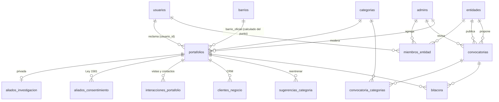

# Base de datos: cómo se organiza y cómo se relaciona

Diseño del 2-oct-2026. Sale de tres fuentes cruzadas:
- el esquema **real** de producción (Neon, `information_schema` y `pg_constraint`, solo lectura);
- la asesoría v2 y el formato técnico (tabla 4.2 del tablero, tabla 4.3 de variables);
- el prototipo `firmamento-app` (`app.js`, `build_data.py`, `pipeline/salidas/*.json`).

Motor: Neon (Postgres 18), ~33 MB de 1 GB. Ver `docs/firmamento-modulos.md` para rutas y roles.

## 1. Los siete dominios

Cada tabla pertenece a UN dominio. Si una tabla nueva no cabe en ninguno, se discute antes de crearla.

| Dominio | Tablas | Quién escribe |
|---|---|---|
| **A. Identidad y acceso** | `usuarios`, `admins` (equipo), `entidades`*, `miembros_entidad`* | Google OAuth, equipo |
| **B. Catálogos** | `categorias`, `barrios`*, `definiciones_campo` | Equipo |
| **C. Negocio** (núcleo) | `portafolios` + `aliados_investigacion`, `aliados_consentimiento`, `interacciones_portafolio`, `clientes_negocio` | Dueño, equipo, sistema |
| **D. Oportunidades** | `convocatorias`, `convocatoria_categorias`* | Vigía, entidad (propone), equipo (decide) |
| **E. Modelos y datos** | `sugerencias_categoria` | Sistema (registro) |
| **F. Bitácora** | `bitacora`* | Todas las acciones que cambian algo |
| **G. Operación** | `intentos_registro`, `visitas_sitio`, `peticiones`, `candidatos`, `_migraciones` | Sistema |

\* nueva en la 033.

**Fuera de la base, a propósito:** comercios OSM y constelaciones (`public/firmamento/constelaciones.json`),
modelo del sugeridor (`public/modelo_categoria.json`), polígonos (`lib/geo/*.json`), fotos (Vercel Blob).
Son productos del pipeline que se regeneran enteros; un id guardado en la base quedaría colgando.

## 2. Diagrama



## 3. Lo que encontré en producción (2-oct)

| # | Hallazgo | Evidencia | Qué se hace |
|---|---|---|---|
| H1 | `portafolios.barrio_oficial` existe desde la 032 y **nadie la escribe** | 10 de 10 filas en `null`; ningún archivo de `lib/` ni `app/` la menciona | FK a `barrios` + relleno con `barrioDe(lat, lon)` + escribirla en registro y edición |
| H2 | `portafolios.constelacion` está muerta | 10 de 10 en `null`; la decisión fue calcularla al vuelo | Se borra |
| H3 | Un aliado aprobado declara «Campo Valdés No. 1» (Comuna 4) | Fila de Restaurante sazón al carbón | Corregir el dato desde el panel; su `barrio_oficial` saldrá del punto |
| H4 | `convocatorias.entidad` es texto libre, y `aplica_a` es un arreglo de ids sin FK | Esquema; la tabla tiene **0 filas** | Se rehace ahora que está vacía: `entidad_id` + tabla puente |
| H5 | Falta `tema` y la formalidad a la que aplica | El prototipo usa `tema` y `aplica_a.formalidad` (`build_data.py:107-114`) | Columnas nuevas |
| H6 | `sugerencias_categoria` no sabe de qué negocio vino | Sin `portafolio_id` | Sin ese dato, «cada corrección reentrena» (asesoría §7) es imposible |
| H7 | No hay registro de lo que cambia | El prototipo tiene «Historial» en Moderación; elegimos que la edición publique directo | Tabla `bitacora` |
| H8 | `candidatos.moderado_por` no tiene `on update cascade` | Las otras 4 FK a `admins(email)` sí lo tienen | Se iguala |

## 4. Tablas nuevas y cambios (migración 033)

```sql
-- ── A · Entidades ───────────────────────────────────────────
-- Una sola tabla para las dos caras de una entidad: la que entra a Firmamento
-- (JAL, CEDEZO, CVS) y la que publica convocatorias (SENA, Bancóldex…). Lo que
-- da acceso NO es el tipo: es tener una fila en miembros_entidad.
create table entidades (
  id      uuid primary key default gen_random_uuid(),
  nombre  text not null unique check (char_length(nombre) between 2 and 120),
  tipo    text not null check (tipo in ('territorial', 'oferente')),
  sitio   text check (sitio is null or sitio ~ '^https?://'),
  activa  boolean not null default true
);

create table miembros_entidad (
  usuario_id   uuid not null references usuarios(id) on delete cascade,
  entidad_id   uuid not null references entidades(id) on delete cascade,
  agregado_por text references admins(email) on update cascade on delete set null,
  creado_en    timestamptz not null default now(),
  primary key (usuario_id, entidad_id)
);

-- ── B · Barrios oficiales ───────────────────────────────────
-- Los 15 de lib/geo/barrios-manrique.json (Alcaldía de Medellín). El nombre es
-- la llave: es lo que ya guardan las filas y lo que muestra la interfaz.
create table barrios (
  nombre text primary key
);
-- insert de los 15 nombres de BARRIOS_COMUNA_3 (lib/geo/constantes.ts)

-- Solo el oficial lleva FK: `barrio` es lo que la persona DICE (el selector
-- ofrece «Otro» con texto libre, lib/geo/constantes.ts) y `barrio_oficial` es lo
-- que dice el punto. Los tableros por barrio usan el oficial.
alter table portafolios
  add constraint portafolios_barrio_oficial_fkey
    foreign key (barrio_oficial) references barrios(nombre) on update cascade,
  drop column constelacion;

-- ── D · Convocatorias (tabla vacía: se rehace sin migrar datos) ──
alter table convocatorias
  drop column entidad,
  drop column aplica_a,
  add column entidad_id uuid not null references entidades(id),
  add column tema text,
  add column origen text not null default 'vigia'
    check (origen in ('vigia', 'entidad', 'equipo')),
  add column propuesta_por uuid references usuarios(id) on delete set null,
  -- vacío = cualquier formalidad; mismos valores que aliados_investigacion.formalidad
  add column aplica_formalidad text[] not null default '{}',
  add constraint chk_convocatoria_propuesta
    check (origen <> 'entidad' or propuesta_por is not null);

-- Ninguna fila = aplica a todas las categorías.
create table convocatoria_categorias (
  convocatoria_id uuid not null references convocatorias(id) on delete cascade,
  categoria_id    text not null references categorias(id),
  primary key (convocatoria_id, categoria_id)
);

-- ── E · Sugeridor ───────────────────────────────────────────
-- Para reentrenar: nombre (de la ficha) + categoría final (la de la ficha,
-- después de las correcciones del equipo). El texto sigue sin guardarse aquí.
alter table sugerencias_categoria
  add column portafolio_id uuid references portafolios(id) on delete set null;

-- ── F · Bitácora ────────────────────────────────────────────
-- Qué pasó, quién y sobre qué. Guarda NOMBRES de campos cambiados, nunca
-- valores: si guardara el WhatsApp viejo, duplicaría datos personales.
create table bitacora (
  id              bigint generated always as identity primary key,
  creado_en       timestamptz not null default now(),
  actor_tipo      text not null check (actor_tipo in ('negocio', 'equipo', 'entidad', 'sistema')),
  actor           text,  -- email del equipo o id de usuario; null = sistema
  accion          text not null,  -- 'ficha_editada', 'aprobado', 'rechazado', 'categoria_corregida', 'convocatoria_aprobada'…
  portafolio_id   uuid references portafolios(id) on delete cascade,
  convocatoria_id uuid references convocatorias(id) on delete cascade,
  campos          text[] not null default '{}'
);
create index idx_bitacora_portafolio on bitacora (portafolio_id, creado_en desc);
create index idx_bitacora_creado on bitacora (creado_en desc);

-- ── G · Consistencia ────────────────────────────────────────
alter table candidatos
  drop constraint candidatos_moderado_por_fkey,
  add constraint candidatos_moderado_por_fkey
    foreign key (moderado_por) references admins(email) on update cascade on delete set null;
```

**Seed de la 033:** las 15 filas de `barrios`; entidades territoriales (JAL Comuna 3, CEDEZO Manrique,
Centro del Valle del Software Manrique) y oferentes del vigía (Fondo Emprender, Bancóldex, Ruta N,
Cámara de Comercio de Medellín, SENA, iNNpulsa).

**Después de la 033 (datos):** rellenar `barrio_oficial` con un script que use `barrioDe`, porque el
polígono vive en JSON y no en SQL. Los 3 aliados fuera del polígono quedan en `null` hasta que se
corrija su punto (TASKS.md).

## 5. Quién lee qué

| Tabla | Público | Negocio | Entidad | Equipo |
|---|---|---|---|---|
| `portafolios` | Solo `COLUMNAS_PUBLICAS` de los aprobados | Su fila completa | ❌ (solo agregados k = 5) | Todo |
| `aliados_investigacion` | ❌ | La suya | Solo conteos k = 5 | Todo |
| `interacciones_portafolio` | ❌ | Las suyas | Agregados k = 5 | Todo |
| `clientes_negocio` | ❌ | Los suyos | ❌ | ❌ (son de terceros) |
| `convocatorias` | ❌ | Aprobadas que le aplican | Aprobadas + las propias | Todo |
| `bitacora` | ❌ | La de su ficha | ❌ | Todo |
| `entidades` / `miembros_entidad` | ❌ | ❌ | La suya | Todo |

El control sigue en el `where` de cada repo (sin RLS, AGENTS.md).

## 6. Lo que pide el prototipo y NO lleva tabla

| Pantalla del prototipo | Sale de |
|---|---|
| Alertas de calidad | `dentroDeManrique` + `barrioDe` + categoría `otros`, al vuelo |
| Mi constelación, alianzas, «invitar vecinos» | `constelacionDe` sobre el JSON de OSM; la invitación es un enlace de WhatsApp |
| Territorio y plan de brigada (CSV) | `portafolios` × `constelaciones.json` |
| Ficha al % | Columnas llenas de `portafolios` |
| Observatorio de la entidad | `obtenerDatosAbiertos` (k = 5), lo mismo que `/firmamento` |
| Salud de las fuentes del vigía | `vigia_informe.json` del pipeline. ponytail: a tabla solo si el panel necesita historia |
| «Demanda sin oferta» (tabla 4.2) | Pendiente: `sugerencias_categoria` con `origen = 'busqueda'` ya existe; falta saber si hubo resultado. Se decide cuando se toque el buscador |

## 7. Código que cambia con la 033

- `lib/db/convocatorias.repo.ts`, `lib/validation/convocatoria.schema.ts`, la ingesta, «Para ti»,
  `/formalizacion` y el panel de convocatorias: de `entidad`/`aplica_a` a `entidad_id` + tabla puente
  + `aplica_formalidad`.
- `registrarPortafolio` y las dos ediciones: escribir `barrio_oficial` y una fila en `bitacora`.
- `registrarPortafolio`: pasar `portafolio_id` a la sugerencia.
- La 033 y este código van **en el mismo cambio**: la migración borra columnas que el código actual lee.
- Se prueba en una rama de Neon antes de producción (la `dev` está archivada).
