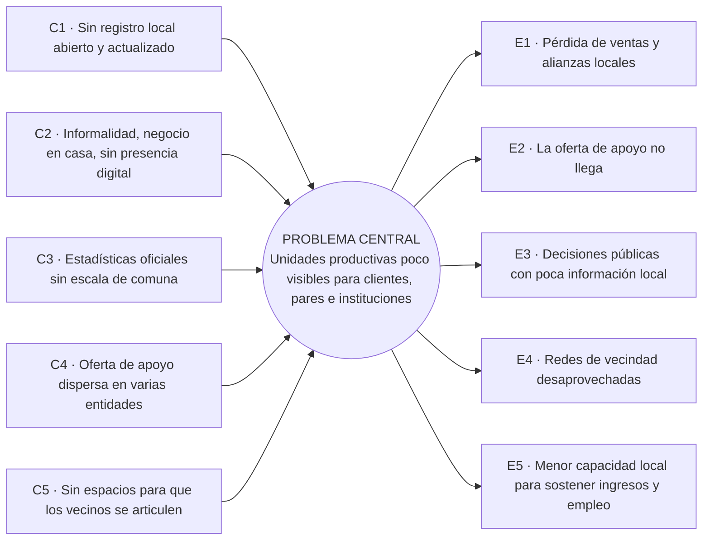

# Árbol de problema · Constelaciones · Manrique

Territorio INN 2026 · Reto #2 Empleo y Desarrollo Económico · Comuna 3 – Manrique

Reglas de construcción: un solo problema central; las causas van a la izquierda y los efectos
a la derecha; ninguna cifra en el árbol (las cifras con fuente están en el Anexo A del documento
técnico). Cada causa se redacta como una condición que existe hoy, y cada efecto como una
consecuencia que se puede observar.

## Problema central

**Las unidades productivas de la Comuna 3 son poco visibles para sus clientes, para otras
unidades productivas y para las instituciones que podrían apoyarlas.**

## Árbol

| CAUSAS (por qué ocurre) | PROBLEMA CENTRAL | EFECTOS (qué produce) |
|---|---|---|
| **C1.** No existe un registro local, abierto y actualizado de los negocios y oficios de la comuna. | **Las unidades productivas de la Comuna 3 son poco visibles para sus clientes, para otras unidades productivas y para las instituciones que podrían apoyarlas.** | **E1.** Los negocios pierden ventas y oportunidades de alianza con vecinos que no saben que existen. |
| **C2.** Muchas unidades productivas son informales o funcionan en la vivienda, sin presencia digital ni registro mercantil. | | **E2.** La oferta pública y privada de apoyo no llega a quienes podrían usarla. |
| **C3.** Las estadísticas oficiales no se publican a escala de comuna, por lo que el territorio no se puede leer con sus propios datos. | | **E3.** Las decisiones de inversión y de Presupuesto Participativo se toman con poca información local. |
| **C4.** La oferta de apoyo está repartida entre varias entidades y portales, cada una con su propio lenguaje y calendario. | | **E4.** Se desaprovechan las relaciones de vecindad que podrían convertirse en redes de compra, venta y aprendizaje. |
| **C5.** Faltan espacios y herramientas para que los negocios vecinos se conozcan y se articulen. | | **E5.** Se limita la capacidad del territorio para sostener ingresos y empleo propios (la visibilidad es una condición necesaria, no suficiente: no garantiza por sí sola empleo digno). |

## Versión gráfica (Mermaid)

## Correspondencia con la solución (referencia interna, no hace parte del árbol)

| Causa | Qué responde hoy | Qué está en desarrollo |
|---|---|---|
| C1 | Directorio con mapa, registro gratuito y moderación humana | Constelaciones comerciales y tablero Firmamento |
| C2 | Registro asistido con consentimiento para quien no usa celular | Censo de campo del piloto |
| C3 | Datos propios agregados y exportación para el panel de moderación | Datos abiertos agregados (`/api/datos`) |
| C4 | Asesor de formalización con catálogo cerrado | Vigía de convocatorias y «Para ti» |
| C5 | Fichas públicas con contacto directo | «Negocios de tu misma constelación» |
